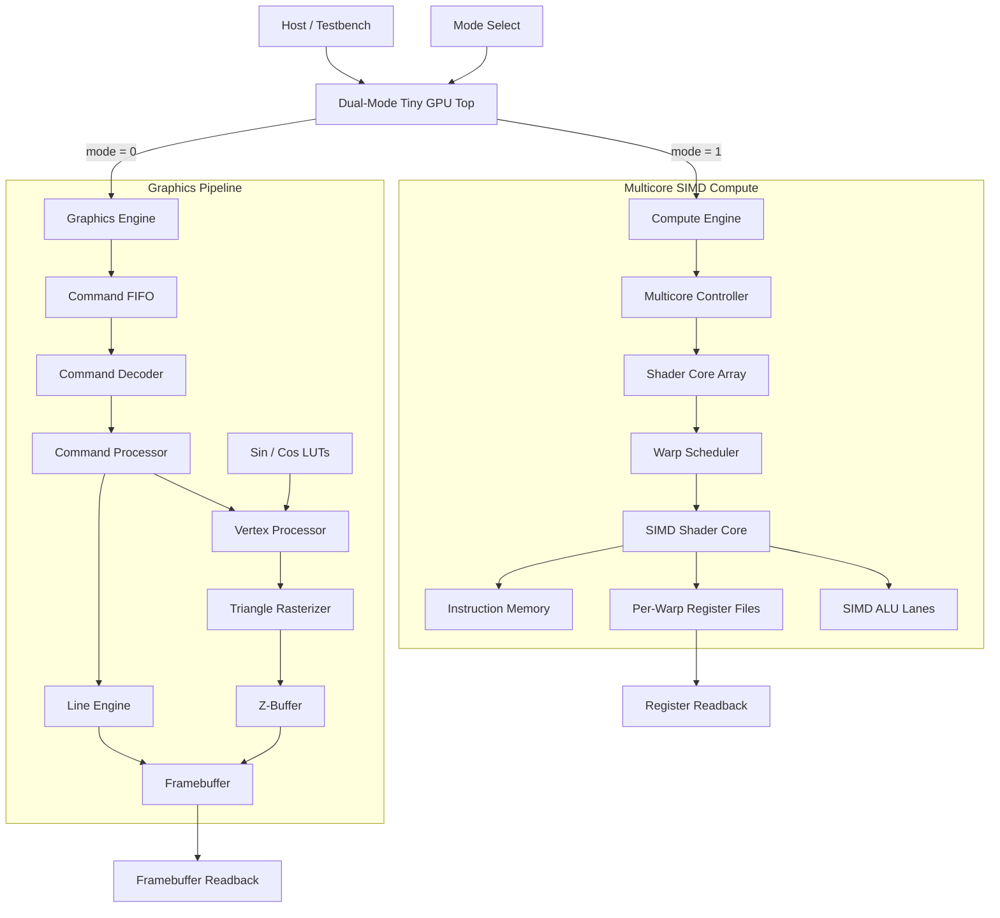
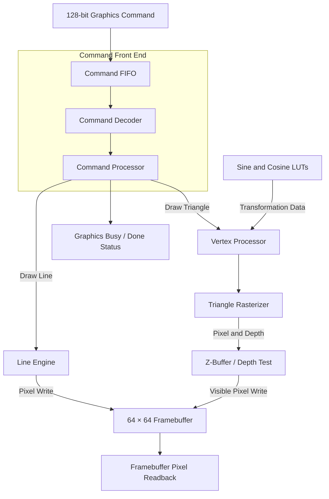
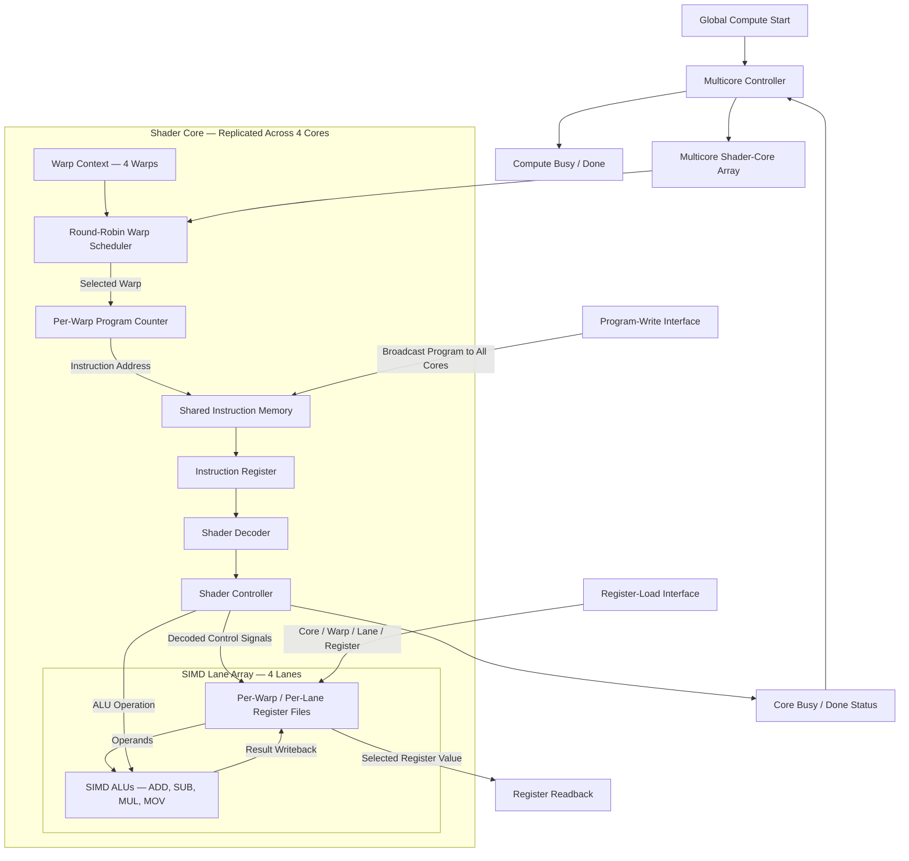

# Dual-Mode Tiny GPU

> A simulation-verified SystemVerilog GPU that combines a fixed-function graphics pipeline and a multicore SIMD compute engine behind one mode-controlled top level.


## The idea

Most small RTL projects demonstrate either graphics hardware or parallel compute hardware. This project puts both into one configurable architecture:

- **Graphics mode** accepts drawing commands and produces pixels through a line engine, vertex processor, triangle rasterizer, Z-buffer, and framebuffer.
- **Compute mode** executes a compact shader-style instruction set across multiple cores, warps, and SIMD lanes.
- **The integration layer** guarantees that only the selected engine accepts new work and delays mode changes until in-flight work has completed.

The result is a compact educational GPU architecture that demonstrates command processing, rasterization, depth testing, SIMD execution, warp scheduling, multicore control, and top-level resource coordination in synthesizable SystemVerilog.

> **Project status:** the complete dual-mode integration has passed its self-checking behavioral simulation in Vivado. It has not yet been synthesized or tested on an FPGA.

## At a glance

| Category | Current configuration |
|---|---|
| RTL language | SystemVerilog |
| Graphics resolution | 64 × 64 pixels |
| Pixel width | 8 bits |
| Depth width | 16 bits |
| Compute cores | 4 |
| Warps per core | 4 |
| SIMD lanes per core | 4 |
| Registers per lane | 8 × 16-bit |
| Shader instructions | ADD, SUB, MUL, MOV |
| Verification | Self-checking Vivado behavioral simulation |

Many major widths and compute resources are parameterized at the RTL level.

## Architecture



## Operating modes

| `mode` | Active engine | Accepted work |
|---:|---|---|
| `0` | Graphics | Drawing commands |
| `1` | Compute | Program writes, register loads, and compute start |

The wrapper exposes both the requested mode and the accepted mode:

- `mode` is the requested operating mode.
- `mode_active` is the mode currently accepted by the hardware.
- `mode_switch_pending` indicates that a requested change is waiting for the active engine to become idle.
- `gpu_busy` remains asserted while either engine has work in flight.

### Safe mode-switching sequence

1. Stop sending new work to the current engine.
2. Wait until `gpu_busy` is low.
3. Change `mode`.
4. Wait until `mode_active == mode`.
5. Confirm that `mode_switch_pending` is low.
6. Submit work to the newly selected engine.

The clocks are never manually gated. Instead, side-effecting request signals are gated according to the accepted mode.

## Graphics mode

The graphics engine implements a small fixed-function rendering path:



### Graphics capabilities

- Buffered 128-bit drawing commands
- Bresenham-style line generation
- Vertex translation, scaling, and rotation support
- Sine and cosine lookup tables
- Triangle rasterization
- Per-pixel depth testing
- 64 × 64, 8-bit framebuffer
- External framebuffer readback

### Command packet

| Bits | Field |
|---:|---|
| `[127:120]` | Opcode |
| `[119:114]` | `x0` |
| `[113:108]` | `y0` |
| `[107:102]` | `x1` |
| `[101:96]` | `y1` |
| `[95:90]` | `x2` |
| `[89:84]` | `y2` |
| `[83:76]` | Color |
| `[75:60]` | `z0` |
| `[59:44]` | `z1` |
| `[43:28]` | `z2` |
| `[27:0]` | Reserved |

### Graphics opcodes

| Opcode | Command | Status |
|---:|---|---|
| `0x00` | NOP | Supported |
| `0x01` | Draw line | Supported |
| `0x02` | Draw triangle | Supported |
| `0x03` | Clear framebuffer | Decoded, sweep operation not yet implemented |

## Compute mode

The compute engine is a parameterized multicore SIMD architecture. A multicore controller dispatches work to available shader cores. Within each core, a round-robin scheduler selects ready warps and executes one shared instruction stream across multiple lanes.



### Default compute configuration

| Parameter | Default |
|---|---:|
| Cores | 4 |
| Warps per core | 4 |
| SIMD lanes per core | 4 |
| Registers per warp/lane context | 8 |
| Register width | 16 bits |
| Instruction width | 16 bits |
| Instruction-memory depth | 16 words |

### Shader instruction format

| Bits | Field |
|---:|---|
| `[15:14]` | Opcode |
| `[13:11]` | Destination register (`rd`) |
| `[10:8]` | Source register 1 (`rs1`) |
| `[7:5]` | Source register 2 (`rs2`) |
| `[4:0]` | Reserved |

### Shader instruction set

| Opcode | Instruction | Operation |
|---:|---|---|
| `00` | ADD | `rd = rs1 + rs2` |
| `01` | SUB | `rd = rs1 - rs2` |
| `10` | MUL | `rd = rs1 × rs2` (lower 16 bits) |
| `11` | MOV | `rd = rs1` |

Programs are loaded through the program-write interface and broadcast to all compute cores. Initial register values can be loaded per core, warp, lane, and register before execution.

## Verification

The integration is verified by `tb/tb_tiny_gpu_top.sv`, a self-checking SystemVerilog testbench.

The testbench checks:

- Reset and default graphics-mode selection
- Blocking compute requests while graphics mode is active
- Drawing a line and checking framebuffer pixels
- Holding a graphics-to-compute switch until graphics completes
- Blocking graphics commands while compute mode is active
- Loading shader instructions into compute instruction memory
- Loading signed input data into individual SIMD lanes
- Executing ADD and MUL instructions
- Reading back and checking computed register values
- Holding a compute-to-graphics switch until compute completes
- Combined `gpu_busy` and `gpu_done` behavior
- Timeout protection and automatic pass/fail reporting

### Verified compute example

The test program performs:

```text
r3 = r1 + r2
r4 = r3 × r2
```

| Lane | `r1` | `r2` | Expected `r3` | Expected `r4` |
|---:|---:|---:|---:|---:|
| 0 | 7 | 5 | 12 | 60 |
| 1 | -3 | 4 | 1 | 4 |

A successful run ends with:

```text
[TB] ALL TESTS PASSED
```

The testbench also produces `tb_tiny_gpu_top.vcd` when the simulator supports VCD dumping.

## Simulating in Vivado

1. Create a new **RTL Project** in Vivado.
2. Add every `.sv` file under these directories as design sources:

   ```text
   rtl/graphics/
   rtl/compute/
   rtl/top/
   ```

3. Add `tb/tb_tiny_gpu_top.sv` as a simulation source.
4. Add `mem/sin_lut.mem` and `mem/cos_lut.mem` to the project, or ensure they are available at the paths used by `trig_lut.sv`.
5. Set `tb_tiny_gpu_top` as the simulation top module.
6. Select **Run Simulation → Run Behavioral Simulation**.
7. Let the simulation run until the testbench prints its final result.

> The project has been behaviorally simulated in Vivado. Synthesis, timing closure, FPGA resource usage, and board-level operation have not yet been validated.

## Repository layout

```text
dual-mode-tiny-gpu/
├── rtl/
│   ├── top/
│   │   └── tiny_gpu_top.sv
│   ├── graphics/
│   │   ├── gpu_top.sv
│   │   ├── command_fifo.sv
│   │   ├── command_decoder.sv
│   │   ├── command_processor.sv
│   │   ├── vertex_processor.sv
│   │   ├── trig_lut.sv
│   │   ├── line_engine.sv
│   │   ├── triangle_rasterizer.sv
│   │   ├── z_buffer.sv
│   │   └── framebuffer.sv
│   └── compute/
│       ├── multicore_compute_gpu.sv
│       ├── multicore_controller.sv
│       ├── multicore_array.sv
│       ├── simd_shader_core.sv
│       ├── simd_lane_array.sv
│       ├── warp_scheduler.sv
│       ├── warp_context.sv
│       ├── shader_controller.sv
│       ├── shader_decoder.sv
│       ├── shader_pc.sv
│       ├── shader_ir.sv
│       ├── shader_imem.sv
│       ├── shader_regfile.sv
│       └── shader_alu.sv
├── tb/
│   └── tb_tiny_gpu_top.sv
├── mem/
│   ├── sin_lut.mem
│   └── cos_lut.mem
├── .gitignore
├── LICENSE
└── README.md
```

## Design decisions

- Graphics and compute are intentionally **mutually exclusive**. This keeps control deterministic and avoids introducing a shared-memory arbiter before one is needed.
- The graphics rasterizer currently produces one pixel candidate per cycle, matching the single-pixel framebuffer and Z-buffer interfaces.
- Triangle transforms are exposed as top-level uniform inputs rather than embedded in each command packet.
- Shader programs are broadcast to all compute cores, while register initialization and readback are individually addressable.
- The inactive engine remains clocked but cannot accept side-effecting requests. This is safer and more portable than manually gating the clock in RTL.

## Current limitations

- Graphics and compute cannot execute concurrently.
- The framebuffer-clear opcode is decoded but the memory sweep controller is not implemented.
- The framebuffer is internal and is not yet connected to VGA or HDMI output.
- The compute engine does not yet implement per-lane active masks or branch divergence.
- The shader ISA has no load/store, branch, or immediate instructions.
- There is no external AXI, Wishbone, or system-memory interface.
- The design is simulation-verified only and has not yet been validated on hardware.

## Roadmap

- [x] Graphics command pipeline
- [x] Line and triangle rendering
- [x] Z-buffer and framebuffer
- [x] Multicore SIMD compute engine
- [x] Warp scheduling and per-warp context
- [x] Dual-mode integration
- [x] Self-checking integration testbench
- [ ] Framebuffer and Z-buffer clear controller
- [ ] Branching and lane-active masks
- [ ] Load/store instructions and shared memory
- [ ] AXI or Wishbone host interface
- [ ] FPGA synthesis and timing analysis
- [ ] VGA or HDMI display output
- [ ] FPGA board demonstration

## Learning goals

This project was built to explore how GPU concepts map into RTL, including:

- Turning drawing commands into pixel operations
- Coordinating variable-latency hardware blocks
- Designing a small programmable SIMD datapath
- Scheduling warps over shared execution hardware
- Scaling one shader core into a multicore architecture
- Integrating independent accelerators behind a safe mode-control interface
- Building self-checking verification for a complete hardware subsystem

## Author

Designed and developed by **MD Reyan**.

Contributions, suggestions, and technical discussions are welcome.
